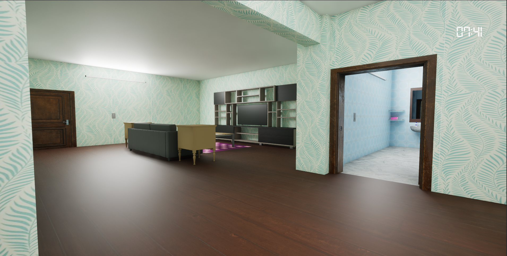
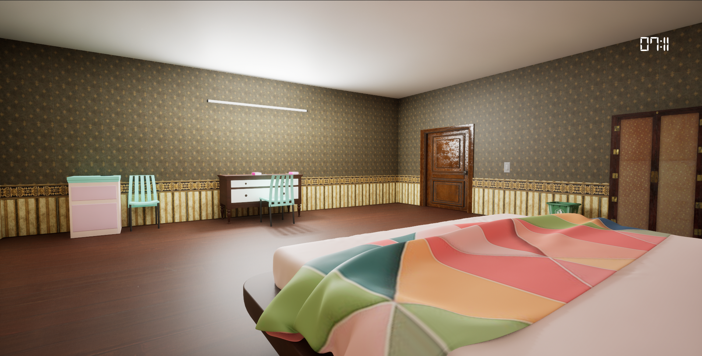
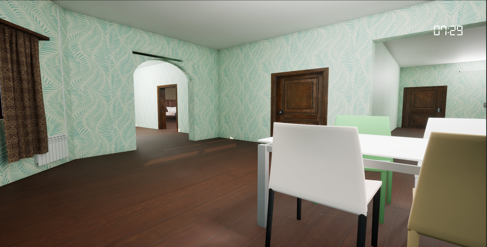

# Interactive Apartment Environment for Life Skills Simulation

## About the Project
This project is an interactive apartment environment built in **Unreal Engine**, specifically designed to assist autistic patients in learning and practicing everyday basic habits. By utilizing a simulated, safe digital space, players can engage with routine household tasks, helping to build familiarity and independence through interactive learning. 

Our team was tasked with conceptualizing, building, and optimizing this environment to ensure it was both functional for simulation mechanics and visually calming and accessible for the target audience.

## Gallery

| Living Area | Bedroom | Dining Area |
| :---: | :---: | :---: |
|  |  |  |

## Development & Roles
This project was developed collaboratively by a team of three members. 

**My Contributions:**
* **Material & Texture Creation:** Authored and applied custom materials across the apartment to ensure a cohesive, readable, and visually appealing aesthetic.
* **Environment Design:** Handled the overall spatial design and layout of the room, ensuring logical flow and appropriate placement of interactive elements for daily habit simulations.
* **Lighting & Polish:** (Optional: *Add any other minor things you did, like lighting, asset placement, or optimization*).

## Tech Stack
* **Game Engine:** Unreal Engine
* **Version Control:** Diversion (Now archived using Git & GitHub LFS)
* **Additional Tools:** Blender
* **Assets used:** SketchFab, Fab
